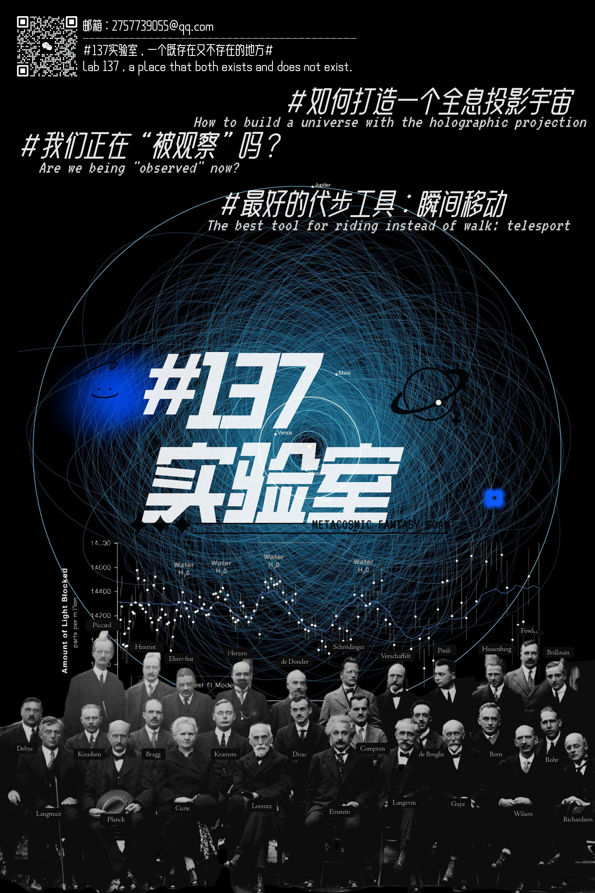

# Lab-137

**Lab 137 — a place that both exists and does not exist.**  
Talks, posters & research notes.

> A small archive of science communication and speculative physics themes:
> observation, holography, and the strange geometry of “reality”.

---

## Quick links
- **Posters** → `posters/`
- **Slides** → `slides/`
- **Reports / Notes** → `reports/`

---

## What’s inside
- `posters/` — event posters (PDF/PNG)
- `slides/` — talk slides (PDF preferred)
- `reports/` — public briefs / research notes (PDF/MD)
- `assets/` — branding images used by README / social preview

---

## Releases
Formal versions of posters/slides are published in **Releases** (e.g., `v1.0`, `v1.1`).

---

## Usage / Rights
© 2026 Lab-137. **All rights reserved.**  
Slides, posters, and reports in this repository may not be redistributed or used commercially without prior permission.

---

## Contact
Open an **Issue** (or **Discussion**) for questions, citation requests, or collaboration.
